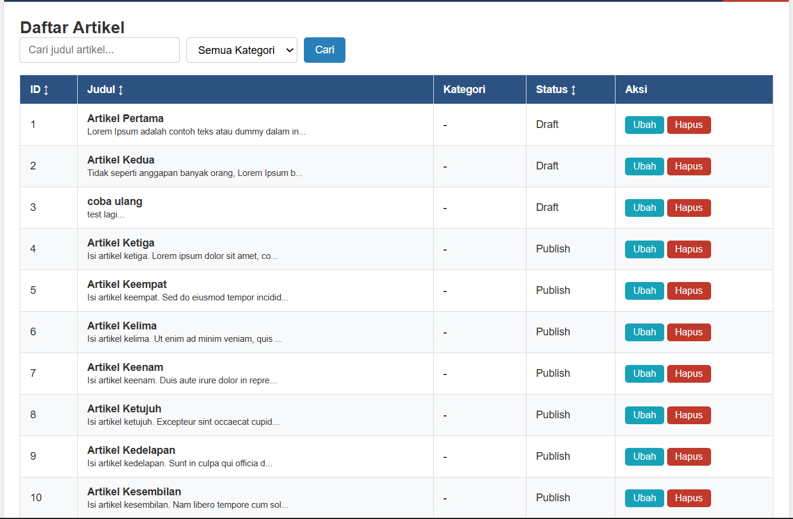

# Laporan Praktikum 9: Implementasi AJAX Pagination dan Search

Repository ini dibuat untuk memenuhi tugas mata kuliah Pemrograman Web 2. Praktikum ini berfokus pada implementasi fitur pembagian halaman (pagination) dan pencarian data (search) secara *asynchronous* menggunakan AJAX dan jQuery pada Framework CodeIgniter 4.

## Tujuan Praktikum
1. Memahami konsep dasar mekanisme AJAX untuk kebutuhan pagination dan searching.
2. Mampu mengimplementasikan pagination dan search menggunakan AJAX di CodeIgniter 4.
3. Meningkatkan performa aplikasi serta kualitas *User Experience* (UX) halaman web.

---

## Langkah-Langkah Praktikum & Penjelasan

### 1. Modifikasi Controller Artikel (`Artikel.php`)
Kita mengubah method `admin_index()` pada Controller Artikel 268, 269]. Modifikasi ini bertujuan agar Controller mampu mendeteksi jenis request yang masuk 300]. Jika request berasal dari AJAX, data artikel beserta status *pager* akan langsung dikonversi dan dikembalikan dalam bentuk objek JSON 300, 301, 312]. Namun, jika diakses langsung secara reguler, server akan merender file View seperti biasa 302, 304, 313].

Berikut adalah penyesuaian kode pada fungsi `admin_index()`:

```php
public function admin_index()
{
    $title = 'Daftar Artikel (Admin)';
    $model = new ArtikelModel();

    // Menangkap parameter pencarian, filter kategori, dan nomor halaman
    $q = $this->request->getVar('q') ?? '';
    $kategori_id = $this->request->getVar('kategori_id') ?? '';
    $page = $this->request->getVar('page') ?? 1;

    // Struktur query menggunakan query builder
    $builder = $model->table('artikel')
                     ->select('artikel.*, kategori.nama_kategori')
                     ->join('kategori', 'kategori.id_kategori = artikel.id_kategori');

    // Kondisi filter pencarian kata kunci judul
    if ($q != '') {
        $builder->like('artikel.judul', $q);
    }

    // Kondisi filter dropdown kategori
    if ($kategori_id != '') {
        $builder->where('artikel.id_kategori', $kategori_id);
    }

    // Eksekusi data pagination sebanyak 10 item per halaman
    $artikel = $builder->paginate(10, 'default', $page);
    $pager = $model->pager;

    $data = [
        'title'       => $title,
        'q'           => $q,
        'kategori_id' => $kategori_id,
        'artikel'     => $artikel,
        'pager'       => $pager
    ];

    // Cek apakah request datang dari AJAX
    if ($this->request->isAJAX()) {
        return $this->response->setJSON($data);
    } else {
        $kategoriModel = new KategoriModel();
        $data['kategori'] = $kategoriModel->findAll();
        return view('artikel/admin_index', $data);
    }
}
```
### 2. Modifikasi View Utama (admin_index.php)Pada file view app/Views/artikel/admin_index.php, komponen rendering tabel HTML statis bawaan dihapus. Sebagai gantinya, kita membuat elemen kontainer <div id="article-container"> dan <div id="pagination-container"> yang nantinya akan diisi secara dinamis melalui respon data dari jQuery.  Berikut adalah penulisan skrip lengkapnya:

```html
<?= $this->include('template/admin_header'); ?>

<h2><?= $title; ?></h2>
<div class="row mb-3">
    <div class="col-md-6">
        <form id="search-form" class="form-inline">
            <input type="text" name="q" id="search-box" value="<?= $q; ?>" placeholder="Cari judul artikel" class="form-control mr-2">
            
            <select name="kategori_id" id="category-filter" class="form-control mr-2">
                <option value="">Semua Kategori</option>
                <?php foreach ($kategori as $k): ?>
                    <option value="<?= $k['id_kategori']; ?>" <?= ($kategori_id == $k['id_kategori']) ? 'selected' : ''; ?>>
                        <?= $k['nama_kategori']; ?>
                    </option>
                <?php endforeach; ?>
            </select>
            <input type="submit" value="Cari" class="btn btn-primary">
        </form>
    </div>
</div>

<div id="article-container"></div>

<div id="pagination-container"></div>

<script src="[https://code.jquery.com/jquery-3.6.0.min.js](https://code.jquery.com/jquery-3.6.0.min.js)"></script>
<script>
$(document).ready(function() {
    const articleContainer = $('#article-container');
    const paginationContainer = $('#pagination-container');
    const searchForm = $('#search-form');
    const searchBox = $('#search-box');
    const categoryFilter = $('#category-filter');

    // Fungsi fetch data dari server
    const fetchData = (url) => {
        $.ajax({
            url: url,
            type: 'GET',
            dataType: 'json',
            headers: {
                'X-Requested-With': 'XMLHttpRequest'
            },
            success: function(data) {
                renderArticles(data.artikel);
                renderPagination(data.pager, data.q, data.kategori_id);
            }
        });
    };

    // Fungsi merender baris data ke dalam struktur tabel HTML
    const renderArticles = (articles) => {
        let html = '<table class="table">';
        html += '<thead><tr><th>ID</th><th>Judul</th><th>Kategori</th><th>Status</th><th>Aksi</th></tr></thead><tbody>';
        
        if (articles.length > 0) {
            articles.forEach(article => {
                html += `<tr>
                    <td>${article.id}</td>
                    <td>
                        <b>${article.judul}</b>
                        <p><small>${article.isi.substring(0, 50)}...</small></p>
                    </td>
                    <td>${article.nama_kategori}</td>
                    <td>${article.status}</td>
                    <td>
                        <a class="btn btn-sm btn-info" href="/admin/artikel/edit/${article.id}">Ubah</a>
                        <a class="btn btn-sm btn-danger" onclick="return confirm('Yakin menghapus data?');" href="/admin/artikel/delete/${article.id}">Hapus</a>
                    </td>
                </tr>`;
            });
        } else {
            html += '<tr><td colspan="5">Tidak ada data.</td></tr>';
        }
        
        html += '</tbody></table>';
        articleContainer.html(html);
    };

    // Fungsi merender nomor link navigasi halaman
    const renderPagination = (pager, q, kategori_id) => {
        let html = '<nav><ul class="pagination">';
        
        // Mengonstruksi ulang link pagination agar sejalan dengan pencarian AJAX
        if (pager && pager.links) {
            pager.links.forEach(link => {
                let url = link.url ? `${link.url}&q=${q}&kategori_id=${kategori_id}` : '#';
                html += `<li class="page-item ${link.active ? 'active' : ''}">
                    <a class="page-link" href="${url}">${link.title}</a>
                </li>`;
            });
        }
        
        html += '</ul></nav>';
        paginationContainer.html(html);
    };

    // Event Trigger saat form pencarian disubmit
    searchForm.on('submit', function(e) {
        e.preventDefault();
        const q = searchBox.val();
        const kategori_id = categoryFilter.val();
        fetchData(`/admin/artikel?q=${q}&kategori_id=${kategori_id}`);
    });

    // Event Trigger saat dropdown filter kategori berubah nilai
    categoryFilter.on('change', function() {
        searchForm.trigger('submit');
    });

    // Event Trigger klik nomor halaman pagination agar tidak reload page penuh
    $(document).on('click', '.pagination .page-link', function(e) {
        e.preventDefault();
        const url = $(this).attr('href');
        if (url !== '#') {
            fetchData(url);
        }
    });

    // Pemuatan data pertama kali saat halaman diakses
    fetchData('/admin/artikel');
});
```

## 📷 Screenshot


### Tampilan Indikator Loading


---


### Sorting



---
</script>

<?= $this->include('template/admin_footer'); ?>
